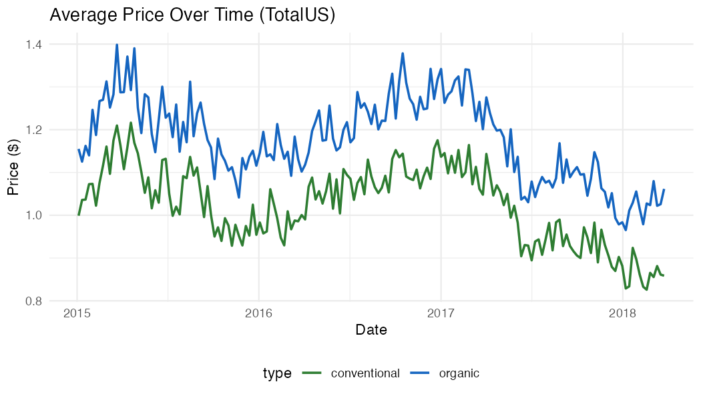
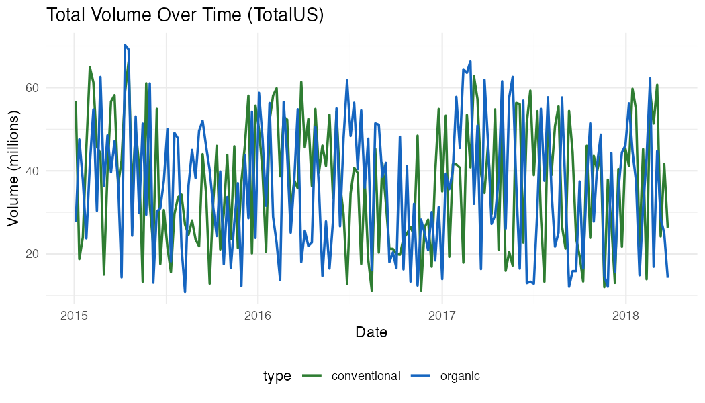
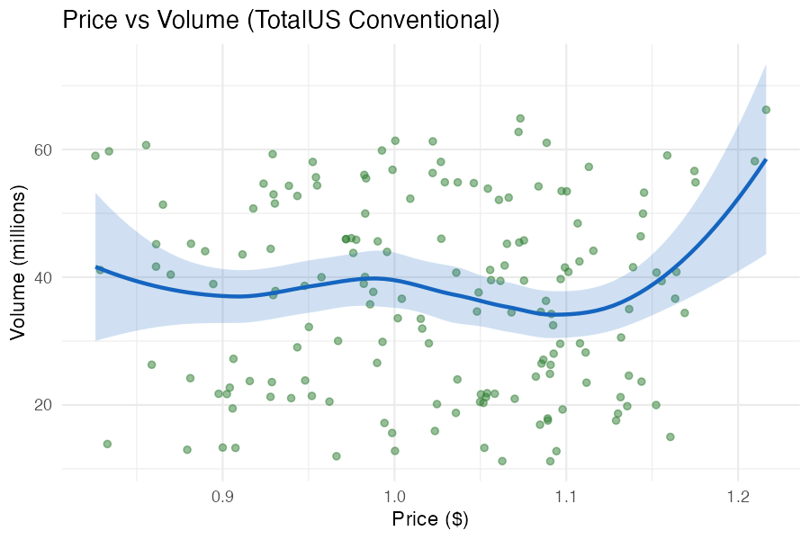
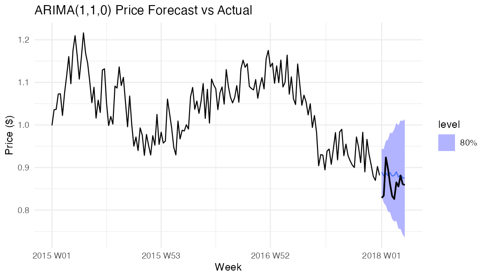
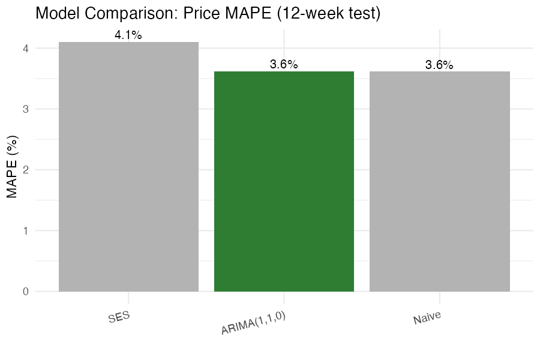
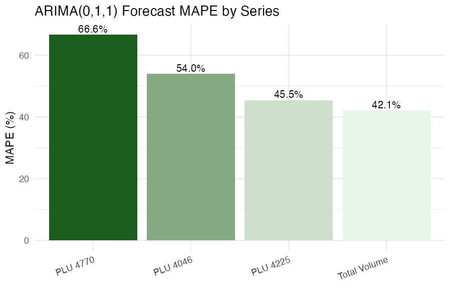
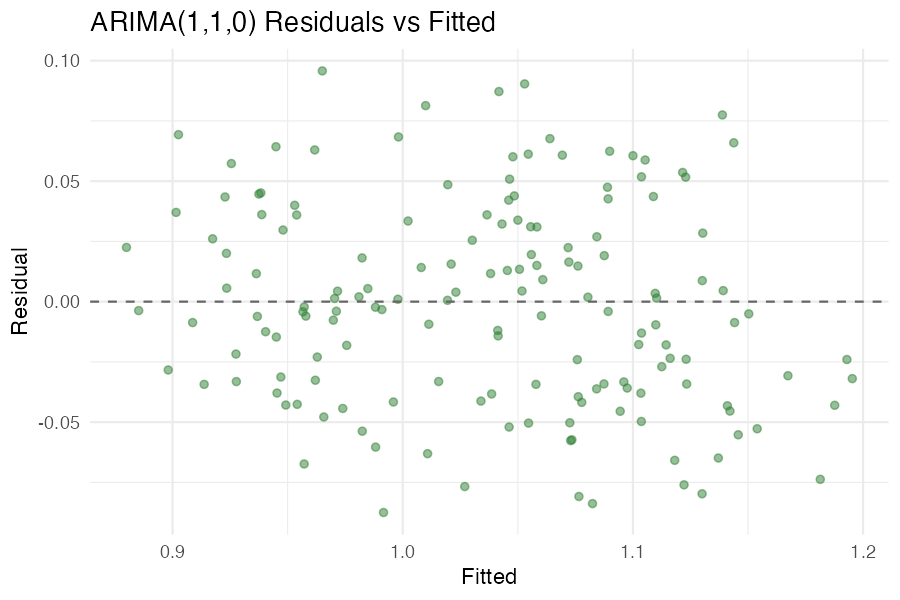

# Avocado Price and Demand Forecasting

Time series analysis of U.S. Hass avocado prices and demand volumes using ARIMA, exponential smoothing, naive forecasting, and Bayesian methods. OM 286 group project.

## Data

- **Source:** Hass Avocado Board retail scanner data (Kaggle: Avocado Prices)
- **Coverage:** January 2015 – March 2018, 169 weeks, 54 U.S. regions
- **Focus:** TotalUS conventional avocados (national aggregate)
- **Targets:** Average retail price ($/unit), total volume, and PLU-level demand (4046 small/medium, 4225 large, 4770 extra-large)

No missing values. Weekly frequency throughout.







## Modelling Strategy

### Framework

Box-Jenkins methodology: stationarity check, first differencing (d=1), ACF/PACF diagnostics, candidate model fit, AICc selection, residual checks (Ljung-Box), out-of-sample forecast.

### Train/Test Split

- Training: first 157 weeks (~93%)
- Test: last 12 weeks (~7%, one quarter)
- Fixed-origin evaluation, no future leakage

### Models

1. **ARIMA** – Primary approach. Candidate orders from ACF/PACF; best model chosen by AICc.
2. **Simple Exponential Smoothing (SES)** – ETS(A,N,N), no trend or seasonality.
3. **Naive** – Last observed value as forecast.
4. **Bayesian AR(1)** – `brms`/Stan on differenced log-prices, N(0,1) priors on intercept and AR coefficient.

### Model Selection Logic

- **Price:** PACF spike at lag 1 with cutoff → AR(1) → ARIMA(1,1,0).
- **Volume:** ACF negative spike at lag 1 → MA(1) mean-reversion → ARIMA(0,1,1).

SARIMA(1,1,0)(1,0,0)[52] was tested but did not improve AICc; with ~3 years of data, seasonal parameters add complexity without clear gain.

### Software

R 4.5, `fable`, `tsibble`, `feasts`, `brms`, `tidyverse`.

## Results

### Price Forecasting

| Model           | RMSE  | MAE   | MAPE  |
|----------------|-------|-------|-------|
| ARIMA(1,1,0)   | 0.098 | 0.080 | 7.3%  |
| SES            | 0.111 | 0.100 | 9.3%  |
| Naive          | 0.112 | 0.100 | 9.3%  |
| Bayesian AR(1) | 0.217 | 0.186 | 16.8% |

ARIMA(1,1,0) improves MAPE by about 21% over Naive. SES and Naive are effectively the same (flat forecast). Bayesian AR(1) underperforms due to cumulative reconstruction error when integrating differenced log-predictions back to levels.





### Volume and PLU Forecasting

| Series      | Model         | RMSE   | MAPE  |
|-------------|---------------|--------|-------|
| Average Price | ARIMA(1,1,0) | 0.098 | 7.3%  |
| Total Volume  | ARIMA(0,1,1) | 5.02M | 9.2%  |
| PLU 4046      | ARIMA(0,1,1) | 1.21M | 7.1%  |
| PLU 4225      | ARIMA(0,1,1) | 1.25M | 8.7%  |
| PLU 4770      | ARIMA(0,1,1) | 126K  | 13.9% |



### Diagnostics

Ljung-Box on ARIMA(1,1,0) residuals: p ≈ 0.86. Residuals consistent with white noise; no remaining autocorrelation.



### Findings

- **Price vs volume structure:** Price shows AR(1) persistence; volume shows MA(1) mean-reversion (inventory dynamics).
- **Forecast difficulty:** Lower-volume PLU 4770 (median ~700K/week) has higher MAPE (13.9%) than high-volume 4046 (10.9M/week, 7.1%). Fewer units and larger relative shocks make small-volume series harder to forecast.
- **Business impact:** For $1M weekly avocado revenue, ARIMA reduces forecast error by ~$20K/week vs Naive. At scale, this supports substantial inventory and waste reduction.

## Recommendations

- Use ARIMA(1,1,0) for price and ARIMA(0,1,1) for volume and all PLUs.
- Re-estimate weekly as new data arrives.
- Use larger safety stock for PLU 4770 given higher forecast uncertainty.
- Use 80% prediction intervals for procurement; they are reasonably well calibrated.

## Reproducibility

```r
install.packages(c("fable", "tsibble", "feasts", "fabletools", "tidyverse", "brms", "gt"))
# If avocado.csv is missing, run: source("scripts/fetch_or_generate_data.R")
rmarkdown::render("avocado_forecasting_analysis.Rmd")
# Regenerate README figures: Rscript scripts/run_analysis_and_figures.R
```

Data: [Kaggle Avocado Prices](https://www.kaggle.com/datasets/neuromusic/avocado-prices)

## File Structure

```
Avocado Project/
├── avocado.csv                       # Raw data (from Kaggle)
├── avocado_forecasting_analysis.Rmd   # Main analysis (recommended)
├── avocado_plu_forecasting.Rmd       # PLU-only ARIMA workflow
├── scripts/
│   ├── fetch_or_generate_data.R       # Data setup
│   └── run_analysis_and_figures.R    # Regenerate README figures
├── docs/figures/                     # README figures (generated)
└── Avocado_Project/
    ├── avocado_forecasting_paper.tex
    └── figures/                      # Paper figures (generated)
```
